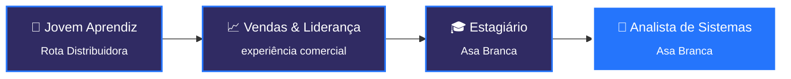

<!-- ====================== HEADER ====================== -->
<p align="center">
  
</p>

<p align="center">
  <a href="https://github.com/mauriciovictorr">
    
  </a>
</p>

<p align="center">
  <a href="https://www.linkedin.com/in/mauriciovictor/" target="_blank"></a>
  <a href="mailto:mauricio404944@gmail.com"></a>
  
  
</p>

<br/>

<!-- ====================== SOBRE MIM ====================== -->
<h2>👨‍💻 Sobre mim</h2>

Sou **Analista de Sistemas na Asa Branca Distribuidora** e estudante de **Engenharia de Software no UMJ**. Comecei como jovem aprendiz, passei pela área comercial, voltei à Asa Branca como estagiário e fui efetivado como analista. Essa bagagem me ajuda a fazer o que mais gosto: **entender a regra de negócio a fundo e transformá-la em sistema**.

No dia a dia, desenvolvo e mantenho sistemas corporativos internos em Django, construo APIs, escrevo consultas SQL, automatizo rotinas com Python e documento entregas para públicos técnicos e gerenciais.

```python
class MauricioVictor:
    def __init__(self):
        self.cargo       = "Analista de Sistemas"
        self.empresa     = "Asa Branca Distribuidora"
        self.formacao    = "Engenharia de Software — UMJ"
        self.comunidade  = "Embaixador do RogaDX 26 🎟️"
        self.stack       = ["Python", "Django", "DRF", "SQL Server", "JavaScript"]
        self.aprendendo  = ["React", "Flutter", "Visão Computacional"]
        self.curte       = ["Linux 🐧", "Open Source", "Comunidades tech"]

    def missao(self) -> str:
        return "Transformar processos manuais em soluções eficientes 🚀"
```

<br/>

<!-- ====================== TRAJETÓRIA ====================== -->
<h2>🧭 Trajetória</h2>



<br/>

<!-- ====================== STACK ====================== -->
<h2>⚒️ Stack & Ferramentas</h2>

<table align="center">
  <tr>
    <td align="center" width="170"><b>🧠 Back-end</b></td>
    <td></td>
  </tr>
  <tr>
    <td align="center"><b>🎨 Front-end</b></td>
    <td></td>
  </tr>
  <tr>
    <td align="center"><b>🗄️ Banco de Dados</b></td>
    <td>
      
      
    </td>
  </tr>
  <tr>
    <td align="center"><b>🔧 Ambiente</b></td>
    <td></td>
  </tr>
  <tr>
    <td align="center"><b>🔭 Explorando</b></td>
    <td></td>
  </tr>
</table>

<p align="center">
  
  
  
  
  
  
  
</p>

<br/>

<!-- ====================== O QUE EU FAÇO ====================== -->
<h2>🚀 O que eu construo</h2>

<table>
  <tr>
    <td width="50%" valign="top">
      <h3>📊 Sistemas corporativos em Django</h3>
      Sistema interno modular de <b>gestão de desempenho e premiação</b>: controle de acessos e permissões, metas, produtividade, formulários, vendas e painéis operacionais, com geração de relatórios em PDF via <b>WeasyPrint</b>.
    </td>
    <td width="50%" valign="top">
      <h3>🔌 APIs & Dados</h3>
      APIs com <b>Django REST Framework</b> documentadas em <b>Swagger</b>, consultas e views em <b>SQL Server</b>, integração com dados de ERP e tratamento de erros em banco.
    </td>
  </tr>
  <tr>
    <td width="50%" valign="top">
      <h3>🤖 RPA & Automações</h3>
      Robôs com <b>Python + Selenium</b> com rastreabilidade de execução, envio automatizado via <b>WhatsApp</b>, geração de imagens e rotinas em <b>Excel/VBA</b>.
    </td>
    <td width="50%" valign="top">
      <h3>🧩 Interfaces web</h3>
      Formulários com máscaras e validações (como validadores de nota fiscal), filtros, páginas responsivas com <b>Bootstrap</b> e evolução para <b>React</b>.
    </td>
  </tr>
  <tr>
    <td colspan="2" valign="top">
      <h3>📝 Documentação que gente de negócio entende</h3>
      Cards de Jira padronizados, páginas no Confluence e descrições de Pull Request escritas para atender ao mesmo tempo o time técnico e a gestão: motivo da demanda, o que foi implementado, migrations e roteiro de homologação.
    </td>
  </tr>
</table>

<br/>

<!-- ====================== AGORA ====================== -->
<h2>⚡ Neste momento</h2>

- 🔭 Evoluindo sistemas corporativos internos na **Asa Branca Distribuidora**
- 🎓 Cursando **Engenharia de Software** no UMJ
- 🎟️ Embaixador do **RogaDX 26**, fortalecendo a comunidade tech
- 🌱 Aprofundando em **React** e explorando **Flutter** e **visão computacional**
- 🐧 Curtindo o universo **Linux e open source**
- 💬 Pode me chamar para conversar sobre **Django, automações, SQL e carreira em TI**

<br/>

<!-- ====================== ESTATÍSTICAS ====================== -->
<h2 align="center">📈 Estatísticas no GitHub</h2>

<p align="center">
  
  
</p>

<p align="center">
  
</p>

<!-- Cobrinha de contribuições (requer o workflow .github/workflows/snake.yml) -->
<p align="center">
  <picture>
    <source media="(prefers-color-scheme: dark)" srcset="https://raw.githubusercontent.com/mauriciovictorr/mauriciovictorr/output/github-snake-dark.svg" />
    <source media="(prefers-color-scheme: light)" srcset="https://raw.githubusercontent.com/mauriciovictorr/mauriciovictorr/output/github-snake.svg" />
    
  </picture>
</p>

<br/>

<!-- ====================== FRASE ====================== -->
<p align="center">
  <i>"Aprender, praticar e evoluir todos os dias."</i>
</p>

<!-- ====================== FOOTER ====================== -->
<p align="center">
  
</p>
